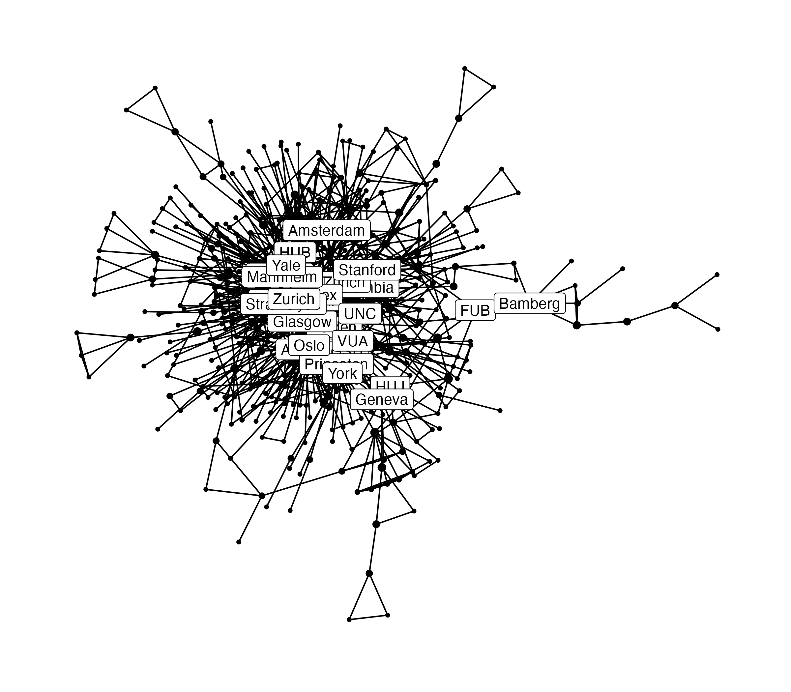

Main project repository: [`briatte/epsaconf`](https://github.com/briatte/epsaconf).

Graph of co-authorship ties between academic organizations, based on papers presented at the [European Political Science Association](https://www.epsanet.org/) (EPSA) 2023 conference:

Some code in this repository was recycled from [`epsa2019`](https://github.com/briatte/epsa2019) and [`epsa2022`](https://github.com/briatte/epsa2022). Everything is very much in draft form, but the data are clean enough for further work.

See also Benjamin Guinaudeau's own [`epsa2023`](https://github.com/benjaminguinaudeau/epsa2023) repository, which contains a slightly different version of [the same data](https://virtual.oxfordabstracts.com/#/event/3738/program), among other things.
